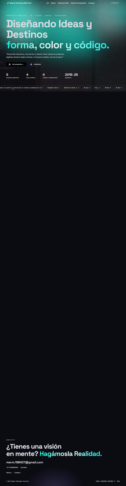
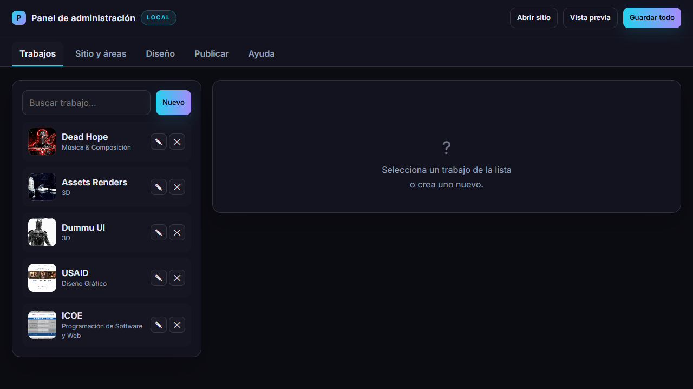
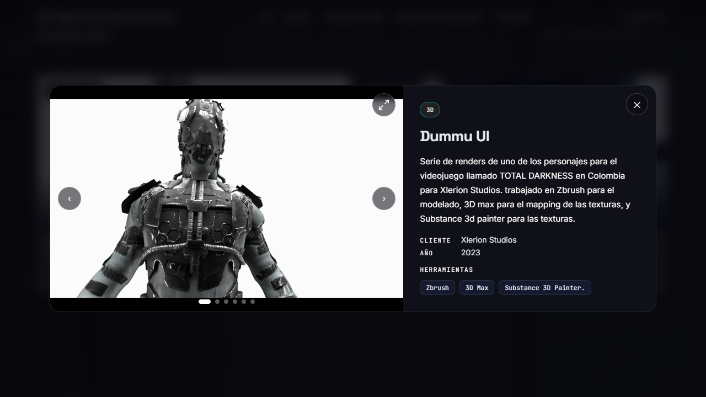

# Miguel Rodríguez Martínez — Portafolio Creativo

Portafolio personal de presentación profesional con panel de administración integrado. Muestra proyectos de **modelado 3D, diseño gráfico, desarrollo de software y composición musical**, con un flujo completo de publicación directa a **GitHub Pages**.


---

## ¿Para qué sirve?

Es una vitrina profesional en la web, pensada para:

- **Presentar proyectos** en distintas áreas creativas (3D, diseño, desarrollo, música) con galerías de imágenes, video y descripciones.
- **Gestionar el contenido sin tocar código**: todo se edita desde un panel privado con acceso por PIN.
- **Publicar automáticamente**: con un clic el sitio se despliega en GitHub Pages usando la API de GitHub, sin necesidad de Git.
- **Personalizar la identidad visual**: colores, tipografías, fondos, parallax y estilo de botones, todo configurable desde el panel.



---

## Características principales

### Frontend (`index.html`)
- Diseño responsive con modo claro/oscuro y animaciones.
- Secciones por área: **3D, Diseño Gráfico, Software & Web, Música & Composición**.
- Galería de proyectos con **modal de imágenes** y comparador "Antes / Después".
- Reproducción de **video** (YouTube, Vimeo o MP4 directo).
- Parallax, tipografías personalizadas y estilo de botones configurable.
- Caché de datos con `?v=` para refrescar contenido al publicar.

### Panel de administración (`admin.html`)
Acceso protegido por **PIN** (persistido en `localStorage`).

| Módulo | Qué permite hacer |
|---|---|
| **Trabajos** | Crear, editar, ordenar y eliminar proyectos; imágenes, videos, enlaces y destacados. |
| **Sitio y áreas** | Editar nombre, claim, hero, descripciones y las áreas del portafolio. |
| **Diseño** | Personalizar colores, gradientes, tipografías, fondo, parallax, botones y el comparador Antes/Después. |
| **Publicar** | Subir `data/portfolio.json` e `index.html` a GitHub Pages y **sincronizar imágenes** faltantes automáticamente. |
| **Ayuda** | Guía integrada del panel. |



### Modal de proyecto
Cada proyecto abre un modal con galería navegable, metadatos (cliente, año, herramientas) y su contenido multimedia.



---

## Arquitectura

```
Personal_Web_Portfolio/
├── index.html            # Sitio público del portafolio
├── admin.html            # Panel de administración (protegido por PIN)
├── serve.js              # Servidor local (sin dependencias externas)
├── data/
│   └── portfolio.json    # Fuente de verdad: sitio, áreas, trabajos y diseño
├── images/               # Imágenes de proyectos y recursos visuales
└── Iniciar.bat           # Launcher para Windows (servidor + navegador)
```

### Flujo de datos

1. El **panel** carga y guarda el estado en `data/portfolio.json` (local) y en `localStorage`.
2. El **frontend** consume `data/portfolio.json` para renderizar el sitio.
3. La **publicación** envía el JSON y el HTML a GitHub mediante la **REST API** (Contents y Git Database para archivos grandes), subiendo antes las imágenes que falten.

### Servidor local (`serve.js`)
Servidor HTTP sin dependencias que expone:

| Endpoint | Método | Función |
|---|---|---|
| `/` | GET | Frontend del portafolio |
| `/admin.html` | GET | Panel de administración |
| `/__api/save` | POST | Guarda `data/portfolio.json` |
| `/__api/upload` | POST | Guarda imágenes/videos en `images/` |
| `/__api/ping` | GET | Comprueba que el backend está activo |

---

## Requisitos

- **Node.js** (para el servidor local).
- **Navegador moderno** (Chrome, Edge, Firefox).
- Cuenta de **GitHub** con token clásico (`repo` scope) para publicar.
- **Windows** para el launcher `Iniciar.bat` (opcional; el resto es multiplataforma).

---

## Instalación y uso

### 1. Iniciar (Windows)

Ejecuta `Iniciar.bat`:

1. Verifica que Node.js esté instalado.
2. Arranca el backend `serve.js` en `http://localhost:5173`.
3. Abre el frontend y el panel de administración en el navegador.

### 2. Sin el launcher (cualquier sistema)

```bash
node serve.js 5173
```

Luego abre:

- Sitio: `http://localhost:5173/`
- Panel: `http://localhost:5173/admin.html`

### 3. Entrar al panel

El acceso está protegido por un **PIN** (por defecto `1234`, cambiable desde el panel).

### 4. Publicar en GitHub Pages

1. Ve a la pestaña **Publicar** del panel.
2. Configura propietario, repositorio, rama y el **token** de GitHub.
3. Pulsa **Publicar**. El panel:
   - Verifica y sube las **imágenes** que faltan en el repositorio (incluye archivos > 1 MB).
   - Publica `data/portfolio.json` e `index.html`.
   - Verifica que el contenido publicado incluya el diseño y el cache-busting.
   - Habilita GitHub Pages en el repositorio si fuera necesario.

> GitHub Pages puede tardar unos minutos en refrescar su caché; recarga con `Ctrl+F5` o en modo incógnito.

---

## Detalles técnicos

- **Sin frameworks**: HTML, CSS y JavaScript vanilla; sin dependencias externas en el servidor.
- **API de GitHub**: publica archivos vía `PUT /repos/{owner}/{repo}/contents/{path}` y usa la **Git Database API** (blob → tree → commit → ref) para archivos superiores a ~1 MB.
- **Normalización de rutas**: las URLs absolutas locales (`http://localhost:5173/...`) se convierten automáticamente a rutas relativas antes de publicar, evitando errores de *mixed content*.
- **Sincronización de imágenes**: al publicar se detectan las referencias a imágenes ausentes en el repositorio y se suben una a una.
- **Persistencia dual**: el panel guarda en `localStorage` (rápido) y en `data/portfolio.json` (fuente de verdad).

---

## Estructura de datos (`data/portfolio.json`)

```jsonc
{
  "site": { "nombre": "...", "claim": "...", "heroLinea1": "...", "heroTags": "..." },
  "areas": [ { "id": "3d", "nombre": "3D" } ],
  "trabajos": [
    {
      "id": "...",
      "titulo": "...",
      "area": "3d",
      "anio": 2023,
      "cliente": "...",
      "descripcion": "...",
      "herramientas": ["..."],
      "destacado": true,
      "imagenes": ["images/..."],
      "video": { "tipo": "youtube", "url": "https://..." },
      "enlaces": []
    }
  ],
  "diseno": {
    "bg": "...", "panel": "...", "gradfrom": "...",
    "fuenteTitulos": "...", "css": "...", "parallax": "...", "beforeAfter": {}
  }
}
```

---

## Capturas

| Vista | Imagen |
|---|---|
| Portada |  |
| Proyectos |  |
| Modal de proyecto |  |
| Panel de administración |  |

---

## Licencia

Uso personal. Los datos, imágenes y contenidos pertenecen a su autor.